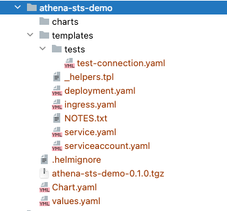

Demo Springboot and AWS project to connect to Athena and Query data (Connect to AWS with an User profile)

create an AWS account.

(you can use terrform to create infra)

create an IAM user and role 

create S3 bucket for Athena 

Create Athena Table

================================

Install docker desktop

Install and run minikuke 

 run minikube using following command 

    minikube start

Run the docker Image in the K8S
================================

1) First build the project clean-install

2) docker build -t athena-sts-demo .

3) docker tag athena-sts-demo gourabp/gp-aws-athena-sts

4) docker push gourabp/gp-aws-athena-sts

5) kubectl apply -f namespace.yaml

6) kubectl apply -f docker-secrets.yaml

7) kubectl apply -f aws-credentials-secret.yaml

8) kubectl apply -f deployment.yaml

======helm=====

Install helm :

https://helm.sh/docs/intro/install/

1) cd ~/<project_src>/aws-springboot-demo/athena-sts-demo

2) Run the following command 

    helm create athena-sts-demo
     
    it will create a folder structure with following files :

    

3) cd thena-sts-demo 

    run following 

    helm package .   

    helm install athena-sts-demo athena-sts-demo-0.1.0.tgz

    helm list --all      

If you want to delete the chat run following 

    helm delete athena-sts-demo       
   
